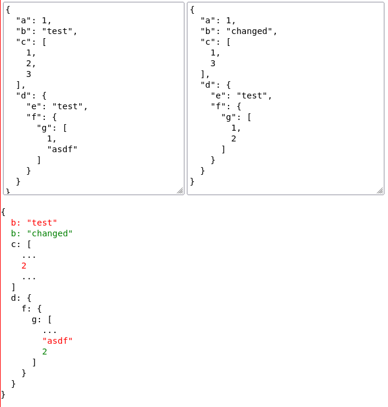

# json-diff-react

A [React.js] component that renders a structural diff of two JSON values. Written in TypeScript
except for the JavaScript code inherited from the original [json-diff] library.
Types are declared for all user facing functionality.

This is a fork of [json-diff] with all of the dependencies towards Node.js core modules removed.
Code from [json-diff] can be found under `src/JsonDiff/Internal` and it’s mostly unchanged — expect
for the `colorize` module which now returns a JSX element instead of a string.



## Simple example

Here is a simple example ([see the full demo of this example](examples/example-02.html)):

``` typescript
function DiffOfJsons({ a, b }: { a: string, b: string }): JSX.Element {
  try {
    // JSON.parse() can throw an exception if parsing fails.
    // It’s for you to handle them before calling <JsonDiffComponent />.
    const parsedA = JSON.parse(a)
    const parsedB = JSON.parse(b);

    return <JsonDiffComponent
      jsonA={parsedA}
      jsonB={parsedB}
      styleCustomization={{
        additionLineStyle: { color: 'green' },
        deletionLineStyle: { color: 'red' },
        unchangedLineStyle: { color: 'gray' },
        frameStyle: {
          'font-family': 'monospace',
          'white-space': 'pre',
          'background': 'silver',
        },
      }}
    />;
  } catch (e: any) {
    return <p>Error: {e?.message ?? JSON.stringify(e)}</p>;
  }
}
```

Look into the [examples](examples) directory to find more examples on how to use this component.

## Usage

The `<JsonDiffComponent />` requires 4 input properties:

1. `jsonA` **(required)**: a JSON value
   - The caller is responsible for providing a valid, parsed JSON value (e.g. via `JSON.parse`)
2. `jsonB` **(required)**: a JSON value that is compared to `jsonA`
   - The caller is responsible for providing a valid, parsed JSON value
3. `styleCustomization` *(optional)*: CSS customization of the markup
4. `jsonDiffOptions` *(optional)*: options that are fed directly to original [json-diff] code

N.B. The type of the input JSON values is described in TypeScript like this (you can import this
type from the library in case you need to use it for the values passed to the
`<JsonDiffComponent />`):

``` typescript
export type JsonValue =
  | { [x: string]: JsonValue }
  | Array<JsonValue>
  | string
  | number
  | boolean
  | null;
```

### Style customization

There are two ways to customize the look of the component:

1. via CSS styles
2. via `styleCustomization` property of `<JsonDiffComponent />`

#### CSS

Add these CSS styles for the component and customize them:

``` css
.deletion {
  /* customization for deleted lines (<div>) */
  color: red;
}

.addition {
  /* customization for added lines (<div>) */
  color: green;
}

.unchanged {
  /* customization for unchanged lines (<div>) */
  color: gray;
}

.diff {
  /* customization for the top-level <div> wrapper that contains the diff */
  font-family: monospace;
  white-space: pre;
}
```

The names of the classes can be customized via `styleCustomization` React property.

#### styleCustomization

You can also use the `styleCustomization` property to customize how the
component looks and rename the CSS classes.

``` typescript
export type StyleCustomization = {
  additionLineStyle: CSS.Properties | null;
  additionClassName: string | null | undefined;
  deletionLineStyle: CSS.Properties | null;
  deletionClassName: string | null | undefined;
  unchangedLineStyle: CSS.Properties | null;
  unchangedClassName: string | null | undefined;
  frameStyle: CSS.Properties | null;
  frameClassName: string | null | undefined;
};
```

Explanation of each customization option:

* `additionLineStyle`: `style` attribute of the HTML `<div>` element that is
  used to render added lines in the diff
  * Defaults to `null` if not specified (means there will be no `style` added)
* `additionClassName`: `className` attribute of the HTML `<div>` element that
  is used to render added lines in the diff
  * Defaults to `addition` if not specified
  * Set to `null` to remove the `class` attribute
* `deletionLineStyle`: `style` attribute of the HTML `<div>` element that is
  used to render deleted lines in the diff
  * Defaults to `null` if not specified (means there will be no `style` added)
* `deletionClassName`: `className` attribute of the HTML `<div>` element that
  is used to render deleted lines in the diff
  * Defaults to `deletion` if not specified
  * Set to `null` to remove the `class` attribute
* `unchangedLineStyle`: `style` attribute of the HTML `<div>` element that is
  used to render unchanged lines in the diff
  * Defaults to `null` if not specified (means there will be no `style` added)
* `unchangedClassName`: `className` attribute of the HTML `<div>` element that
  is used to render unchanged lines in the diff
  * Defaults to `unchanged` if not specified
  * Set to `null` to remove the `class` attribute
* `frameStyle`: `style` attribute of the HTML `<div>` element that contains the
  whole rendered diff, i.e. the top level `<div>`
  * Can be used to customize background, etc.
  * Defaults to `null` if not specified (means there will be no `style` added)
* `frameClassName`: `className` attribute of the HTML `<div>` element that
  contains the whole rendered diff, i.e. the top level `<div>`
  * Defaults to `diff`
  * Set to `null` to remove the `class` attribute


### Options fed to json-diff

You can pass options to the underlying [json-diff] functions via
`jsonDiffOptions` which has the following type:

``` typescript
export interface DiffOptions {
  verbose?: boolean;
  raw?: boolean;
  keysOnly?: boolean;
  full?: boolean;
  sort?: boolean;
  outputKeys?: string[];
  keepUnchangedValues?: boolean;
  outputNewOnly?: boolean;
  maxElisions?: number;
  precision?: number;
  excludeKeys?: string[];
}
```

All of the fields are optional. Consult the original [json-diff] library to
learn more about how the options impact the output.

Most of this type came from
https://github.com/DefinitelyTyped/DefinitelyTyped/blob/master/types/json-diff/index.d.ts.

N.B. I added the `excludeKeys` attribute to the `DiffOptions` imported from
`DefinitelyTyped`. It appears like the type definitions in `DefinitelyTyped`
are outdated.

## Authors

Thanks to Andrey Tarantsov for the work he did on the original [json-diff] package.
This package is just a thin wrapper on top of it.

Thanks to Viacheslav Lotsmanov for providing code review and change suggestions.

This package was built at [RELEX](https://www.relexsolutions.com/).

Main developer: [Joonas Laukka](https://github.com/skyvier).

## License

This software is distributed under the MIT license.
For details, have a look at [LICENSE-MIT](LICENSE-MIT).

[json-diff]: https://github.com/andreyvit/json-diff
[React.js]: https://reactjs.org
